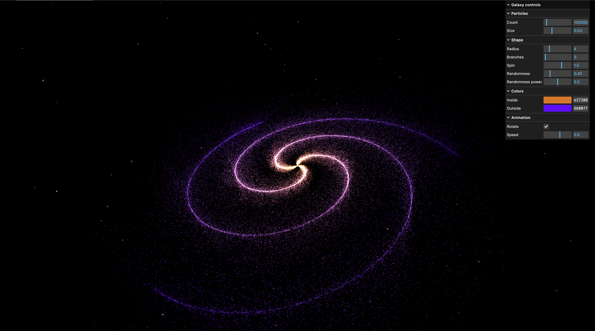

# Galaxy Generator

A real-time 3D scene built with Three.js: a procedural spiral galaxy of 100,000 particles, slowly rotating inside a field of coloured background stars.



## What it demonstrates

**Procedural generation.** Every particle is placed by code, with no model or texture defining the shape. Each one is assigned to a branch, pushed out along it by a random radius, and twisted by a spin angle that grows with distance from the centre. A random offset raised to a power keeps most particles tight to the branch while letting a few scatter far from it.

**Colour gradient.** Each particle's colour is interpolated between an inside and an outside colour based on its distance from the centre, and stored as a per-vertex attribute so the whole galaxy renders in a single draw call.

**Particle rendering.** An alpha map turns the default square points into soft round particles. Additive blending with depth writing disabled lets overlapping particles brighten each other instead of hiding one another, which gives the dense core its glow.

**Background starfield.** A thousand stars are placed in a spherical shell around the scene, each at a random direction and distance, so none of them sit inside the galaxy or in front of the camera. Every star picks its colour from a palette based on real stellar temperatures, from blue to red.

**Animation.** The galaxy rotates with a slight wobble, and the stars turn slowly with it. The rotation angle is accumulated frame by frame, so pausing or changing the speed never makes the scene jump.

**Real-time controls.** A lil-gui panel groups particle, shape, colour and animation parameters into folders. Changing a shape parameter rebuilds the galaxy and disposes the previous geometry and material, so tweaking never leaks GPU memory.

## Controls

The **Galaxy controls** panel is split into folders:

| Folder | Controls |
|---|---|
| Particles | Count, Size |
| Shape | Radius, Branches, Spin, Randomness, Randomness power |
| Colors | Inside, Outside |
| Animation | Rotate, Speed |

Drag to orbit the camera and scroll to zoom.

## Built with

- [Three.js](https://threejs.org/) r174
- [Vite](https://vite.dev/) 6
- [lil-gui](https://lil-gui.georgealways.com/)

## Running locally

Requires [Node.js](https://nodejs.org/) 18 or newer.

```bash
npm install     # install dependencies
npm run dev     # start the dev server at localhost:5173
npm run build   # build for production into dist/
```

## Credits

Built following lesson 18 of [Three.js Journey](https://threejs-journey.com/) by Bruno Simon, with additional work on the rotation, round particles, background stars and debug panel.

Particle textures from [Kenney](https://kenney.nl/assets/particle-pack) (CC0).
